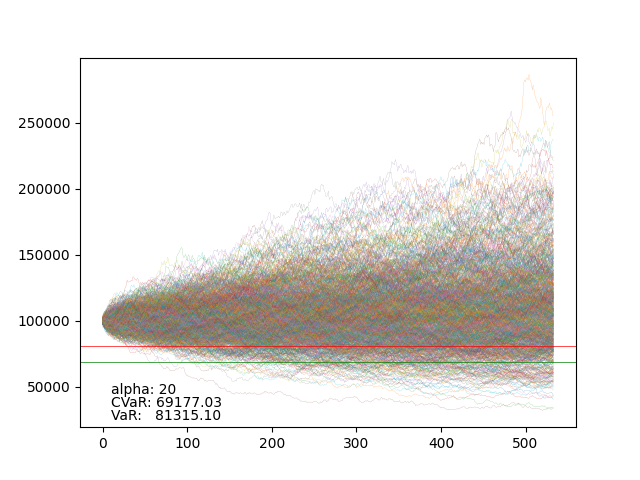

# VaR and CVaR Calculation

using openbb data / y finance

portfolio of sector ETFs

This will create an image like so:


### How To

```bash
poetry install
poetry shell
jupypter lab  # opens browser at root dir
```

In the notebook, run cells with `<Shft-CR>`
